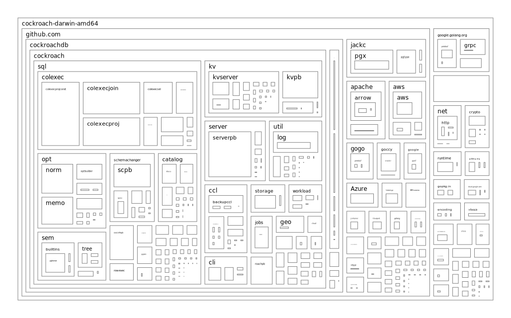

# go-size-analyzer

[](https://goreportcard.com/report/github.com/Zxilly/go-size-analyzer)
[](https://github.com/Zxilly/go-size-analyzer/actions/workflows/tests.yml)
[](https://codecov.io/github/Zxilly/go-size-analyzer)
[](https://github.com/Zxilly/go-size-analyzer/releases)

一个简单的工具，用于分析 Go 编译二进制文件的大小。

## 安装

从[发布页面](https://github.com/Zxilly/go-size-analyzer/releases)下载最新版本。

不要使用 `go install`，因为 gsa 使用修改后的依赖项，而 `go install`不允许使用 `replace` 指令。

## 使用

### Example

#### Web mode

```bash
$ gsa --web golang-compiled-binary
```

将在 8080 端口启动一个 web 服务器，您可以在浏览器中查看结果。

网页将如下所示：


您可以点击以展开包以查看详细信息。

#### 文本模式

```bash
$ gsa docker-compose-linux-x86_64
+------------------------------------------------------------------------------+
| docker-compose-linux-x86_64                                                  |
+---------+-----------------------------------------------+--------+-----------+
| PERCENT | NAME                                          | SIZE   | TYPE      |
+---------+-----------------------------------------------+--------+-----------+
| 27.76%  | .gopclntab                                    | 17 MB  | section   |
| 15.17%  | .rodata                                       | 9.5 MB | section   |
| 11.63%  | k8s.io/api                                    | 7.3 MB | vendor    |
| 6.69%   | .strtab                                       | 4.2 MB | section   |
| 3.47%   | k8s.io/client-go                              | 2.2 MB | vendor    |
| 3.37%   | .symtab                                       | 2.1 MB | section   |
| 2.28%   | github.com/moby/buildkit                      | 1.4 MB | vendor    |
| 1.54%   | github.com/gogo/protobuf                      | 968 kB | vendor    |
| 1.53%   | github.com/google/gnostic-models              | 958 kB | vendor    |
| 1.33%   | github.com/aws/aws-sdk-go-v2                  | 836 kB | vendor    |
| 1.26%   | crypto                                        | 790 kB | std       |
| 1.25%   | google.golang.org/protobuf                    | 782 kB | vendor    |
| 1.24%   | k8s.io/apimachinery                           | 779 kB | vendor    |
| 1.24%   | net                                           | 777 kB | std       |
| 1.20%   | github.com/docker/compose/v2                  | 752 kB | main      |
| 0.95%   | .noptrdata                                    | 596 kB | section   |
| 0.93%   | go.opentelemetry.io/otel                      | 582 kB | vendor    |
| 0.85%   | google.golang.org/grpc                        | 533 kB | vendor    |
| 0.71%   | runtime                                       | 442 kB | std       |
| 0.59%   | github.com/docker/buildx                      | 371 kB | vendor    |
| 0.55%   | github.com/docker/docker                      | 347 kB | vendor    |
| 0.53%   |                                               | 331 kB | generated |
| 0.52%   | golang.org/x/net                              | 326 kB | vendor    |
| 0.47%   | github.com/theupdateframework/notary          | 294 kB | vendor    |

...[Collapsed]...

| 0.00%   | database/sql/driver                           | 128 B  | std       |
| 0.00%   | .note.go.buildid                              | 100 B  | section   |
| 0.00%   | hash/fnv                                      | 96 B   | std       |
| 0.00%   | maps                                          | 96 B   | std       |
| 0.00%   | github.com/moby/sys/sequential                | 64 B   | vendor    |
| 0.00%   | .text                                         | 1 B    | section   |
+---------+-----------------------------------------------+--------+-----------+
| 97.65%  | KNOWN                                         | 61 MB  |           |
| 100%    | TOTAL                                         | 63 MB  |           |
+---------+-----------------------------------------------+--------+-----------+

```

#### Svg 模式

```bash
gsa cockroach-darwin-amd64 -f svg -o data.svg --hide-sections
```



### 完整选项

```bash
Usage: gsa <file> [flags]

A tool for analysing the size of dependencies in compiled Golang binaries,
providing insight into their impact on the final build.

Arguments:
  <file>    Binary file to analyze

Flags:
  -h, --help             Show context-sensitive help.
      --verbose          Verbose output
  -f, --format="text"    Output format, possible values: text,json,html,svg
      --no-disasm        Skip disassembly pass
      --no-symbol        Skip symbol pass
  -o, --output=STRING    Write to file
      --version          Show version

Text output options
  --hide-sections    Hide sections
  --hide-main        Hide main package
  --hide-std         Hide standard library

Json output options
  --indent=INDENT    Indentation for json output
  --compact          Hide function details, replacement with size

Svg output options
  --width=1028         Width of the svg treemap
  --height=640         Height of the svg treemap
  --margin-box=4       Margin between boxes
  --padding-box=4      Padding between box border and content
  --padding-root=32    Padding around root content

Web explorer options
  --web               use web interface to explore the details
  --listen=":8080"    listen address
  --open              Open browser
```

> [!CAUTION]
>
> 该工具可以分析剥离 symbol 的二进制文件，但可能导致结果不准确。

## TODO

- [ ] 添加更多用于反汇编二进制文件的模式
- [ ] 从 dwarf 段提取信息
- [x] 计算符号本身的大小到包中
- [ ] 添加其他图表，如火焰图、饼图等
- [ ] 支持 demangle cgo 中的 C++/Rust 符号
- [ ] 添加 TUI 模式以探索

## Contribution

欢迎任何形式的贡献，随时提出问题或拉取请求。

## LICENSE

根据 [AGPL-3.0](./LICENSE) 发布。
